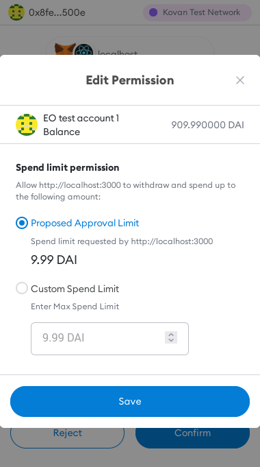
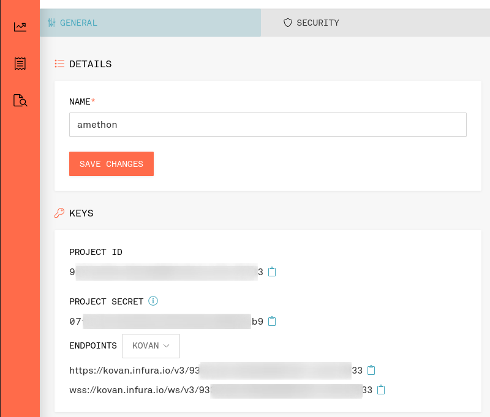

# Accepting Crypto Payments in a Classic Commerce App

E-commerce storefronts are surprisingly slowly adapting crypto tokens as a payment method. Crypto payment plugins or payment gateway integrations aren't generally available or rely on a 3rd party custodian to collect, exchange and distribute revenues. Considering the growing ownership rate and experimentation ratio of crypto currencies, a "pay with token" button could be a great addition to any online shop to drive sales. Here we demonstrate how you can integrate a secure crypto payment method into any online store without relying on any 3rd party service.

## Scenario: the amethon bookstore

The goal is to build a storefront for downloadable ebooks that accepts the blockchain's native Ether currency and ERC20 stablecoins (pegged in USD) as payment which allows us to do without an external exchange rate service apart from an updated ETH/USD rate that we will just assume fixed for simplicity's sake.

### application structure

The store is built as a very plain express CRUD API with no direct connection to any blockchain. Its frontend relies on a plain Create React App setup and the settlement layer consists of an Ethereum smart contract that accepts Ether and ERC20 payments.

Amethon is "classic" ecommerce application so it must take care of the business logic itself. To initiate the checkout transaction the backend creates a `PaymentRequest` object with an unique identifier that users are supposed to send along their payment transaction. Once the payment has settled, a permanently running daemon listens to corresponding payment events emitted by the contract layer and updates the store's database when a payment has settled. To authenticate requests for the final download step the backend requires the customer's individual signature. The full Amethon implementation can be found on our [github repo](https://github.com/elmariachi111/amethon). All code is written in Typescript and can be compiled using the respective `yarn build` or `yarn dev` commands.

## Contracts

### The PaymentReceiver contract

The heart of our bookstore is an Ethereum `PaymentReceiver` smart contract that accepts payments on behalf of the storefront owner. Provided they don't contain any errors themselves, smart contracts can be considered trustworthy fund keepers and hence are a great place to store income. Every time a user sends funds to the `PaymentReceiver` contract, it emits an `PaymentReceived` event that contains information about the payment origin (the buyer's Ethereum account), its total value, the token contract used, and the `paymentId` that all interactions refer to.

```solidity
  event PaymentReceived(
    address indexed buyer,
    uint256 value,
    address token,
    bytes32 paymentId
  );
```

Ethereum contract accounts act in the same way as any other user based account (called "externally owned" or EOA) but allow us to overwrite default functions that are invoked when someone transfers Ether funds to the contract:

```solidity
  receive() external payable {
    emit PaymentReceived(msg.sender, msg.value, ETH_ADDRESS, bytes32(0));
  }

  fallback() external payable {
    emit PaymentReceived(
      msg.sender, msg.value, ETH_ADDRESS, bytes32(msg.data));
  }
```

[Solidity's official docs](https://docs.soliditylang.org/en/v0.8.11/contracts.html?highlight=receive#special-functions) point out the subtle differences between both: `receive` is a default function invoked when the incoming transaction doesn't contain any additional data, otherwise `fallback` gets called. Ethereum's native currency is not an ERC20 token itself and has no utility besides being a counting unit but it got its own identifiable address (`0xEeeeeEeeeEeEeeEeEeEeeEEEeeeeEeeeeeeeEEeE`) that goes into the emitted payment event.

Plain Ether transfers come with a caveat: the amount of computation allowed upon reception is extremely low. The gas sent along by users merely allow us to emit an event but not to redirect funds to the store owner's original address. We therefore decided to have the receiver contract keep all incoming Ethers and allow the store owner to release them to their own account at any time:

```solidity
function getBalance() public view returns (uint256) {
  return address(this).balance;
}

function release() external onlyOwner {
  (bool ok, ) = _owner.call{value: getBalance()}("");
  require(ok, "Failed to release Eth");
}
```

Accepting ERC20 tokens as a payment is slightly more difficult for historical reasons. In 2015 the authors of its [initial specification](https://eips.ethereum.org/EIPS/eip-20) couldn't predict the upcoming requirements and kept the standard's interface as simple as possible. This effectively means that there's no way for a contract to figure out whether someone sent ERC20 to it because there simply is no universally accepted callback mechanism in the plain specification. Today things are different, though: The [EIP 1363](https://eips.ethereum.org/EIPS/eip-1363) standard is addressing this very problem but [it is not implemented](https://twitter.com/ahmetaygun/status/1462168627159916554?s=20&t=9JFFvtuCHGQpCc7iCK8N1Q) by major stablecoin platforms.

The traditional way for a contract to accept ERC20 tokens is to create their own acceptance method which transfers funds on behalf of the current user. The commonly accepted tradeoff here is that users must first allow the contract to do so which unfortunately currently requires them to first send an `Approval` transaction to the ERC20 token contract before interacting with the real payment method. [EIP-2612](https://github.com/ethereum/EIPs/issues/2613) might once improve this situation but for now we have to play by the rules:

```solidity
  function payWithErc20(
    IERC20 erc20,
    uint256 amount,
    uint256 paymentId
  ) external {
    erc20.transferFrom(msg.sender, _owner, amount);
    emit PaymentReceived(
      msg.sender,
      amount,
      address(erc20),
      bytes32(paymentId)
    );
  }
```



### Compiling and Deploying

There are several toolchains that allow you to compile, deploy and interact with smart contracts, but one of the most advanced ones is the [Truffle Suite](https://trufflesuite.com/). It comes with a builtin develoment blockchain based on Truffle's Ganache and a migration concept that lets you automate and safely execute contract deployments. To be able to deploy on "real" blockchain infrastructure, such as Ethereum testnets, one needs two things: an Ethereum provider that's connected to a blockchain node and the private keys of an account that can sign transactions on behalf of the user and has some Ethers on it to pay for gas fees during deployment.

An account can be created and exported easily using Metamask: just create another account you're not using for anything else, fund it with some Eth using the testnet's faucet (we can recommend [Paradigm](https://faucet.paradigm.xyz/)) and export its private key using "Account Details" > "Export Private Key". For security reasons keys **never** must be committed to your code; our examples makes use of `.env` files instead: you can copy all packages' `.env` files to a gitignored `.env.local` and override the values safely, e.g. the `DEPLOYER_PRIVATEKEY` variable.

Connecting to the Ethereum network requires access to a synced node. While you certainly could download one of the many clients and wait some days to have it synced on your machine, the by far much simpler and industry wide accepted solution is to connect to Ethereum nodes that are offered as a service, e.g. by [Infura](https://infura.io/). Their free tier provides you with 3 different access keys and 100k RPC requests per month and they support a wide range of Ethereum networks. Once signed up take note of your Infura key and put it in your `contracts` `.env.local` as `INFURA_KEY`.



Our `truffle.config.js` shows how everything fits together:

```
 const HDWalletProvider = require('@truffle/hdwallet-provider');
 const dotenv = require('dotenv-flow');
 dotenv.config();

 module.exports = {
   networks: {
     kovan: {
       provider: () => new HDWalletProvider({
         privateKeys: process.env.DEPLOYER_PRIVATEKEY.split(","),
         url: `https://kovan.infura.io/v3/${process.env.INFURA_KEY}`
       }),
       network_id: 42, // Kovan
       gas: 5000000,
       confirmations: 1,
       timeoutBlocks: 200,
       skipDryRun: false
     }
   },
   compilers: {
     solc: {
       version: "0.8.11",

     }
   }
 };
```

Local development doesn't require any special setup. Change to the `contracts` folder and run `yarn truffle develop`. This will start a local blockchain with prefunded accounts and open a connected console on it. Type `compile` to compile all contracts at once and deploy them to your the local chain with `migrate`. You can interact with the deployed instances by requesting the currently deployed instance of it and calling its methods like this:

```
pr = await PaymentReceiver.deployed()
balance = await pr.getBalance()
```

Once you're fine with your results you can deploy them on a public testnet (or mainnet), as well:

```
yarn truffle migrate --interactive --network kovan
```

## The Backend

### the store API / CRUD

The foremost task of our backend is to provide a REST-like API to access CRUD resources. We've decided to go with TypeORM to setup a local SQLite database and created entities for `Book`s and `PaymentRequest`s. Books obviously represent our shop's main entity and have a retail price, denoted in USD cents. On a sidenote: storing monetary values as integers is highly adviseable on any computer system because operating on float values will certainly introduce precision errors - all tokens on Ethereum operate with 18 decimal digits and 1 Ether therefore represents "1000000000000000000" _wei_, the smallest ether unit.

```typescript
import { Entity, Column, PrimaryColumn, OneToMany } from "typeorm";
import { PaymentRequest } from "./PaymentRequest";

@Entity()
export class Book {
  @PrimaryColumn()
  ISBN: string;

  @Column()
  title: string;

  @Column()
  retailUSDCent: number;

  @OneToMany(
    () => PaymentRequest,
    (paymentRequest: PaymentRequest) => paymentRequest.book
  )
  payments: PaymentRequest[];
}
```

Users who intend to _buy_ a book from our store, first create an individual `PaymentRequest` for their item by invoking the `/books/:isbn/order` route. It creates a new unique identifier that must be sent along each request. We're using plain integers here but for real use cases you'd want to use something more sophisticated - just make sure that its binary length fits into 32 bytes, which translate to one uint256 in Solidity. Each `PaymentRequest` inherits the books retail value in USD cents and carries the receiver's address; thus a book can effectively bought as a gift for another address. `fulfilledHash` and `paidUSDCent` will be determined during the buying process. The frontend will request already existing `PaymentRequest`s by calling the `/books/:isbn/payments/:address` route.

```typescript
import { Entity, Column, ManyToOne, PrimaryGeneratedColumn } from "typeorm";
import { Book } from "./Book";

@Entity()
export class PaymentRequest {
  @PrimaryGeneratedColumn()
  id: number;

  @Column("varchar", { nullable: true })
  fulfilledHash: string | null;

  @Column()
  address: string;

  @Column()
  priceInUSDCent: number;

  @Column("mediumint", { nullable: true })
  paidUSDCent: number;

  @ManyToOne(() => Book, (book) => book.payments)
  book: Book;
}
```

```json
POST http://localhost:3001/books/978-0060850524/order
Content-Type: application/json

{
  "address": "0xceeca1AFA5FfF2Fe43ebE1F5b82ca9Deb6DE3E42"
}
---
{
  "paymentRequest": {
    "book": {
      "ISBN": "978-0060850524",
      "title": "Brave New World",
      "retailUSDCent": 1034
    },
    "address": "0xceeca1AFA5FfF2Fe43ebE1F5b82ca9Deb6DE3E42",
    "priceInUSDCent": 1034,
    "fulfilledHash": null,
    "paidUSDCent": null,
    "id": 6
  },
  "receiver": "0x7A08b6002bec4B52907B4Ac26f321Dfe279B63E9"
}

```

To initially seed the database with books you can use the accompanying `seed.ts` file that once compiled can be executed by invoking `node build/seed.js`.

### The blockchain listener daemon

At its core a blockchain is a never ending list of consecutive transactions that modify one huge state tree. Querying the state tree from clients doesn't cost any gas but requires (Infura's) nodes to read data - when that those operations become too computation heavy, they might simply time out. For real time interactions it therefore is highly recommended to not poll contract view methods but listen to events emitted by transactions instead. This is how the backend's `daemon.ts` script listens for `PaymentReceived` events:

```typescript
  const paymentReceiver = new web3.eth.Contract(
    paymentReceiverAbi as AbiItem[],
    process.env.PAYMENT_RECEIVER_CONTRACT as string
  );

  const emitter = paymentReceiver.events.PaymentReceived({
    fromBlock: "0",
  });

  emitter.on("data", handlePaymentEvent);
})();
```

Take note of how we're instantiating the `Contract` instance with an "ABI": this "Application Binary Interface" is a compiler generated output that contains information for RPC clients which methods, events and arguments exist on a smart contract. Once instantiated you can hook a listener on the contract's `PaymentReceived` logs (starting at block 0) and handle them once received.

Since Amethon shall shall support Ether and stablecoin ("USD") payments the `handlePaymentEvent` methods first checks which token has been used in the user's payment and computes its dollar value if necessary:

```typescript
const ETH_USD_CENT = 2_200 * 100;
const ACCEPTED_USD_TOKENS = (process.env.STABLECOINS as string).split(",");
const NATIVE_ETH = "0xEeeeeEeeeEeEeeEeEeEeeEEEeeeeEeeeeeeeEEeE";

const handlePaymentEvent = async (event: PaymentReceivedEvent) => {
  const args = event.returnValues;
  const paymentId = web3.utils.hexToNumber(args.paymentId);
  const decimalValue = web3.utils.fromWei(args.value);
  const payment = await paymentRepo.findOne({ where: { id: paymentId } });
  let valInUSDCents;
  if (args.token === NATIVE_ETH) {
    valInUSDCents = parseFloat(decimalValue) * ETH_USD_CENT;
  } else {
    if (!ACCEPTED_USD_TOKENS.includes(args.token)) {
      return console.error("payments of that token not supported");
    }
    valInUSDCents = parseFloat(decimalValue) * 100;
  }

  if (valInUSDCents < payment.priceInUSDCent) {
    return console.error(`payment [${paymentId}] not sufficient`);
  }

  payment.paidUSDCent = valInUSDCents;
  payment.fulfilledHash = event.transactionHash;
  await paymentRepo.save(payment);
};
```

## The Frontend

Our bookstore's frontend is built using a plain [Create React App](https://create-react-app.dev/) template with Typescript support and [Tailwind](https://tailwindcss.com/) for basic styles. CRA5 bumped their webpack dependency to a version that doesn't support node polyfills in browsers anymore which breaks the builds of nearly all Ethereum related projects today. A common workaround that avoids ejecting is to hook into the CRA build process - we decided to use [react-app-rewired](https://github.com/timarney/react-app-rewired) or go with CRA4 until the community agreed to a better solution.

### connecting to web3

The most crucial part of a Dapp is to get a connection to an user's wallet. While you could try to manually wire that process up according to [the official Metamask docs](https://docs.metamask.io/guide/getting-started.html), we strongly recommend going with an appropriate React library; we found Noah Zinsmeister's [web3-react](https://www.npmjs.com/package/web3-react) to do the job best. Detecting and connecting to a web3 client then boils down to this code (`ConnectButton.tsx`):

```tsx
import { useWeb3React } from "@web3-react/core";
import { InjectedConnector } from "@web3-react/injected-connector";
import React from "react";
import Web3 from "web3";

export const injectedConnector = new InjectedConnector({
  supportedChainIds: [42, 1337, 31337], //Kovan, Truffle, Hardhat
});

export const ConnectButton = () => {
  const { activate, account, active } = useWeb3React<Web3>();

  const connect = () => {
    activate(injectedConnector, console.error);
  };

  return active ? (
    <div className="text-sm">connected as: {account}</div>
  ) : (
    <button className="btn-primary" onClick={connect}>
      Connect
    </button>
  );
};
```

By wrapping your app's code in an `<Web3ReactProvider getLibrary={getWeb3Library}>` context you can access the web3 provider, account and connected state using the `useWeb3React` hook from anywhere. Since Web3React is agnostic to the web3 library being used ([Web3.js](https://www.npmjs.com/package/web3) or [ethers.js](https://www.npmjs.com/package/ethers)), you must provide a callback that yields a connected "library" once:

```typescript
import Web3 from "web3";
function getWeb3Library(provider: any) {
  return new Web3(provider);
}
```

## usage

### paying with ETH

### paying with Stablecoins

### signing download requests

## Deploying on a public testnet

## Outlook
