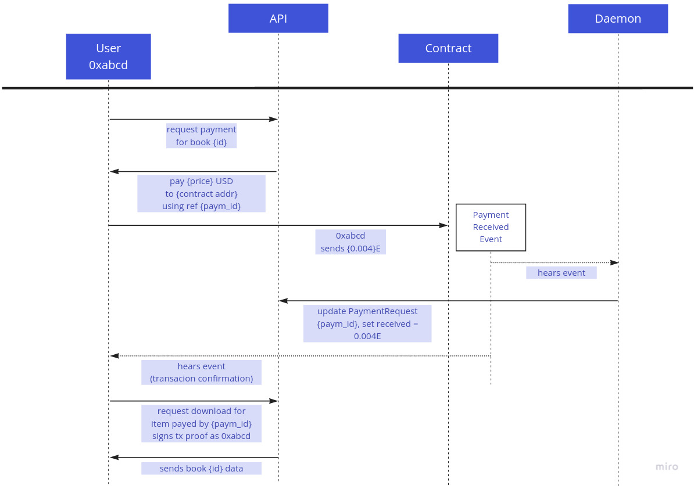
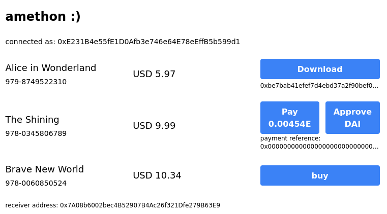
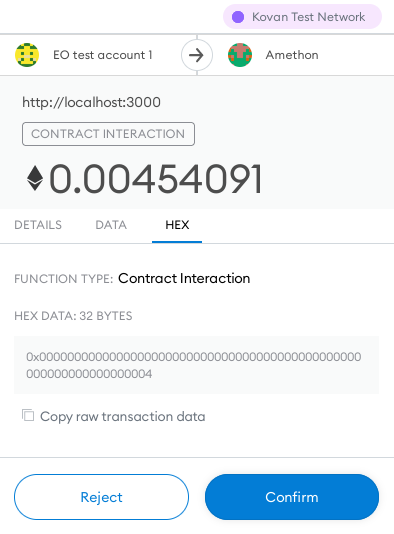
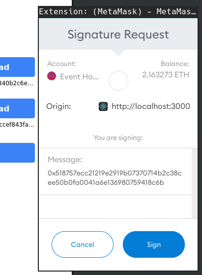

# Accepting Crypto Payments in a Classic Commerce App

E-commerce storefronts are surprisingly slow to offer crypto payment methods to their customers. Crypto payment plugins or payment gateway integrations aren't generally available or rely on 3rd party custodians to collect, exchange and distribute money. Considering the growing ownership rate and experimentation ratio of crypto currencies, a "pay with crypto" button could greatly drive sales, though. This article demonstrates how you can integrate a custom secure crypto payment method into any online store without relying on a 3rd party service.

## Scenario: the Amethon Bookstore

The goal is to build a storefront for downloadable ebooks that accepts the Ethereum blockchain's native currency ("Ether") and ERC20 stablecoins (payment tokens pegged in USD) as payment method. Lets refer to it as "Amethon" from here on.

### Application Structure

The store backend is built as a plain express CRUD API that is not connected to any blockchain itself. Its frontend triggers payment requests on that API which customers fulfill using their crypto wallets.

Amethon is designed as a "traditional" e-commerce application that takes care of the business logic itself and doesn't rely on any onchain data besides the payment itself. Upon checkout initiation the backend issues `PaymentRequest` objects that carry an unique identifier (i.e. an "invoice number") that users attach to their payment transactions. A background daemon listens to the respective contract events and updates the store's database when a payment has been detected. The full Amethon implementation can be found on our [github monorepo](https://github.com/elmariachi111/amethon). All code is written in Typescript and can be compiled using the package's `yarn build` or `yarn dev` commands.



## The PaymentReceiver contract

At the center of Amethon the `PaymentReceiver` smart contract accepts and escrows payments on behalf of the storefront owner. Provided they're user error free, smart contracts can be considered 100% trustworthy and uncompromiseable funds keepers. Each time a user sends funds to the `PaymentReceiver` contract, a `PaymentReceived` event is emitted containing information about the payment's origin (the customer's Ethereum account), its total value, eventually the ERC20 token contract address being used, and the `paymentId` that refers to the backend's database entry.

```solidity
  event PaymentReceived(
    address indexed buyer,
    uint256 value,
    address token,
    bytes32 paymentId
  );
```

Ethereum contracts act very similar to user based (aka "externally owned" / EOA) accounts and get their very own account address upon deployment. Receiving the native Ether currency requires us to implement `receive` and `fallback` functions which are invoked by convention when someone transfers Ether funds to the contract and no other function signature matches the call:

```solidity
  receive() external payable {
    emit PaymentReceived(msg.sender, msg.value, ETH_ADDRESS, bytes32(0));
  }

  fallback() external payable {
    emit PaymentReceived(
      msg.sender, msg.value, ETH_ADDRESS, bytes32(msg.data));
  }
```

[Solidity's official docs](https://docs.soliditylang.org/en/v0.8.11/contracts.html?highlight=receive#special-functions) point out the subtle difference between both: `receive` is invoked when the incoming transaction doesn't contain any additional data, otherwise `fallback` gets called. Ethereum's native currency itself is not an ERC20 token and has no utility besides being a counting unit. However, it's got an identifiable address (`0xEeeeeEeeeEeEeeEeEeEeeEEEeeeeEeeeeeeeEEeE`) that we use to signal an Ether payment in our `PaymentReceived` events.

Ether transfers have a major shortcoming: the amount of allowed computation upon reception is extremely low. The gas sent along by customers merely allows us to emit an event but not to redirect funds to the store owner's original address. We therefore decided to have the receiver contract keep all incoming Ethers and allow the store owner to release them to their own account at any time:

```solidity
function getBalance() public view returns (uint256) {
  return address(this).balance;
}

function release() external onlyOwner {
  (bool ok, ) = _owner.call{value: getBalance()}("");
  require(ok, "Failed to release Eth");
}
```

Accepting ERC20 tokens as a payment is slightly more difficult for historical reasons. In 2015 the authors of their [initial specification](https://eips.ethereum.org/EIPS/eip-20) couldn't predict the upcoming requirements and kept the ERC20 standard's interface as simple as possible. Most notably ERC20 contracts aren't guraranteed to notify recipients about transfers so there's no way for our `PaymentReceiver` to execute code when ERC20 tokens are transferred to it.

The ERC20 ecosystem has evolved in the meanwhile and brought up additional specs like the [EIP 1363](https://eips.ethereum.org/EIPS/eip-1363) standard that address this very problem. Unfortunately you cannot rely on major stablecoin platforms to [have implemented it yet](https://twitter.com/ahmetaygun/status/1462168627159916554?s=20&t=9JFFvtuCHGQpCc7iCK8N1Q).

In effect, Amethon has to accept ERC20 token payments in the "classic" way. Instead of "dropping" tokens on it unittingly, the contract takes care of the transfer on behalf of the customer. This requires users to first _allow_ the contract to handle a certain amount of their funds. Unconveniently that requires them to first transmit an `Approval` transaction to the ERC20 token contract before interacting with the real payment method. [EIP-2612](https://github.com/ethereum/EIPs/issues/2613) might once improve this situation but for now we have to play by the old rules:

```solidity
  function payWithErc20(
    IERC20 erc20,
    uint256 amount,
    uint256 paymentId
  ) external {
    erc20.transferFrom(msg.sender, _owner, amount);
    emit PaymentReceived(
      msg.sender,
      amount,
      address(erc20),
      bytes32(paymentId)
    );
  }
```


### Compiling, Deploying and Variable Safety

Several toolchains allow developers to compile, deploy and interact with Ethereum smart contracts, but one of the most advanced ones is the [Truffle Suite](https://trufflesuite.com/). It comes with a builtin develoment blockchain based on [Ganache](https://trufflesuite.com/ganache/) and a migration concept that lets you automate and safely run contract deployments. Deploying contracts on "real" blockchain infrastructure, such as Ethereum testnets, requires two things: an Ethereum provider that's connected to a blockchain node and the private keys or wallet mnemonics of an account that can sign transactions on behalf of the user and has some Ethers on it to pay for gas fees during deployment.

Metamask does that job: create a new account that you're not using for anything else but deployment (it will become the "owner" of the contract), fund it with some Eth using your preferred testnet's faucet (we recommend [Paradigm](https://faucet.paradigm.xyz/)) and export that account's private key ("Account Details" > "Export Private Key"). For security reasons keys **never** must be committed to your code but preferrably is part of secret environment variables passed to an application on start. The Amethon project relies on `dotenv-flow` for that: `.env` files contain samples or publicly visible settings, which are overridden in gitignored `.env.local` files. Get started by copying all `.env` files in the packages' subdirectories to `.env.local`s and override their values, e.g. the `DEPLOYER_PRIVATEKEY` variable by the deployer account's private key you just exported.

To connect your local environment to an Ethereum network you need access to a synced blockchain node. While you certainly could download one of the many clients and wait some days to have it synced on your machine, the by far much more convenient way happens to be an industry wide accepted solution. It is very common to connect your applications to Ethereum nodes that are offered as a service, the most well-known being [Infura](https://infura.io/). Their free tier provides you with 3 different access keys and 100k RPC requests per month supporting a wide range of Ethereum networks. Once signed up take note of your Infura key and put it in your `contracts` `.env.local` as `INFURA_KEY`.


This is how Amethon's `truffle.config.js` uses the configured environment variables to create a connect to the `kovan` testnet:

```
 const HDWalletProvider = require('@truffle/hdwallet-provider');
 const dotenv = require('dotenv-flow');
 dotenv.config();

 module.exports = {
   networks: {
     kovan: {
       provider: () => new HDWalletProvider({
         privateKeys: process.env.DEPLOYER_PRIVATEKEY.split(","),
         url: `https://kovan.infura.io/v3/${process.env.INFURA_KEY}`
       }),
       network_id: 42, // Kovan
       gas: 5000000,
       confirmations: 1,
       timeoutBlocks: 200,
       skipDryRun: false
     }
   },
   compilers: {
     solc: {
       version: "0.8.11"
     }
   }
 };
```

If you'd like to interact with contracts on the Kovan network, you simply add a `--network kovan` option to all your `truffle` commands. You can even start an interactive console: `yarn truffle console --network kovan`. To code and test contracts locally there's no special setup needed, though. Change to the `contracts` folder and run `yarn truffle develop`. This will start a local blockchain with prefunded accounts and opens a connected console on it. Type `compile` to compile all contracts at once and deploy them to your the local chain with `migrate`. You can interact with contracts by requesting their currently deployed instance and call its functions like so:

```
pr = await PaymentReceiver.deployed()
balance = await pr.getBalance()
```

Once you're fine with your results you can deploy them on a public testnet (or mainnet), as well:

```
yarn truffle migrate --interactive --network kovan
```

## The Backend

### The Store API / CRUD

Our backend provides a JSON API to interact with payment entities on a high level. We've decided to use [TypeORM](https://typeorm.io/) and a local SQLite database to support entities for `Book`s and `PaymentRequest`s. Books represent our shop's main entity and have a retail price, denoted in USD cents. To initially seed the database with books you can use the accompanying `seed.ts` file that once compiled can be executed by invoking `node build/seed.js`.

```typescript
//backend/src/entities/Book.ts
import { Entity, Column, PrimaryColumn, OneToMany } from "typeorm";
import { PaymentRequest } from "./PaymentRequest";

@Entity()
export class Book {
  @PrimaryColumn()
  ISBN: string;

  @Column()
  title: string;

  @Column()
  retailUSDCent: number;

  @OneToMany(
    () => PaymentRequest,
    (paymentRequest: PaymentRequest) => paymentRequest.book
  )
  payments: PaymentRequest[];
}
```

Heads up: storing monetary values as float values [is strongly discouraged](https://stackoverflow.com/questions/3730019/why-not-use-double-or-float-to-represent-currency) on any computer system because operating on float values will certainly introduce precision errors. That's also a reason why all crypto tokens operate with 18 decimal digits and Solidity doesn't even have a float data type. 1 Ether actually represents "1000000000000000000" _wei_, the smallest ether unit.

Users who intend to _buy_ a book from Amethon create an individual `PaymentRequest` for their item first by calling the `/books/:isbn/order` route. It creates a new unique identifier that must be sent along each request. We're using plain integers here but for real life use cases you'll use something more sophisticated - only restriction is the id's binary length that must fit into 32 bytes (uint256). Each `PaymentRequest` inherits the book's retail value in USD cents and bears the customer's address, `fulfilledHash` and `paidUSDCent` will be determined during the buying process.

```typescript
//backend/src/entities/PaymentRequest.ts
@Entity()
export class PaymentRequest {
  @PrimaryGeneratedColumn()
  id: number;

  @Column("varchar", { nullable: true })
  fulfilledHash: string | null;

  @Column()
  address: string;

  @Column()
  priceInUSDCent: number;

  @Column("mediumint", { nullable: true })
  paidUSDCent: number;

  @ManyToOne(() => Book, (book) => book.payments)
  book: Book;
}
```

An initial order request that creates a `PaymentRequest` entity looks like:

```json
POST http://localhost:3001/books/978-0060850524/order
Content-Type: application/json

{
  "address": "0xceeca1AFA5FfF2Fe43ebE1F5b82ca9Deb6DE3E42"
}
--->
{
  "paymentRequest": {
    "book": {
      "ISBN": "978-0060850524",
      "title": "Brave New World",
      "retailUSDCent": 1034
    },
    "address": "0xceeca1AFA5FfF2Fe43ebE1F5b82ca9Deb6DE3E42",
    "priceInUSDCent": 1034,
    "fulfilledHash": null,
    "paidUSDCent": null,
    "id": 6
  },
  "receiver": "0x7A08b6002bec4B52907B4Ac26f321Dfe279B63E9"
}

```

### The Blockchain Listener Background Service

Querying a blockchain's state tree doesn't cost clients any gas but nodes still need to compute. When those operations become too computation heavy, they might simply time out. Hence, for real time interactions it is highly recommended to not poll chain state but rather listen to events emitted by transactions. This requires websocket enabled providers and once again, Infura got us covered: simply use their `wss://` schemed provider URLs for your backend's `PROVIDER_RPC` environment variable. Then you can start the backend's `daemon.ts` script and listen for `PaymentReceived` events on any chain:

```typescript
//backend/src/daemon.ts
  const web3 = new Web3(process.env.PROVIDER_RPC as string);
  const paymentReceiver = new web3.eth.Contract(
    paymentReceiverAbi as AbiItem[],
    process.env.PAYMENT_RECEIVER_CONTRACT as string
  );

  const emitter = paymentReceiver.events.PaymentReceived({
    fromBlock: "0",
  });

  emitter.on("data", handlePaymentEvent);
})();
```

Take note of how we're instantiating the `Contract` instance with an "ABI": the [Application Binary Interface](https://docs.soliditylang.org/en/v0.8.11/abi-spec.html) is generated by the Solidity compiler and contains information for RPC clients how to encode transactions to invoke and decode functions, events or parameters on a smart contract. Once instantiated you can hook a listener on the contract's `PaymentReceived` logs (starting at block 0) and handle them once received.

Since Amethon shall support Ether and stablecoin ("USD") payments, the daemon's `handlePaymentEvent` method first checks which token has been used in the user's payment and computes its dollar value if needed:

```typescript
//backend/src/daemon.ts
const ETH_USD_CENT = 2_200 * 100;
const ACCEPTED_USD_TOKENS = (process.env.STABLECOINS as string).split(",");
const NATIVE_ETH = "0xEeeeeEeeeEeEeeEeEeEeeEEEeeeeEeeeeeeeEEeE";

const handlePaymentEvent = async (event: PaymentReceivedEvent) => {
  const args = event.returnValues;
  const paymentId = web3.utils.hexToNumber(args.paymentId);
  const decimalValue = web3.utils.fromWei(args.value);
  const payment = await paymentRepo.findOne({ where: { id: paymentId } });
  let valInUSDCents;
  if (args.token === NATIVE_ETH) {
    valInUSDCents = parseFloat(decimalValue) * ETH_USD_CENT;
  } else {
    if (!ACCEPTED_USD_TOKENS.includes(args.token)) {
      return console.error("payments of that token are not supported");
    }
    valInUSDCents = parseFloat(decimalValue) * 100;
  }

  if (valInUSDCents < payment.priceInUSDCent) {
    return console.error(`payment [${paymentId}] not sufficient`);
  }

  payment.paidUSDCent = valInUSDCents;
  payment.fulfilledHash = event.transactionHash;
  await paymentRepo.save(payment);
};
```

## The Frontend

Our bookstore's frontend is built on the official [Create React App](https://create-react-app.dev/) template with Typescript support and uses [Tailwind](https://tailwindcss.com/) for basic styles. Heads up: CRA5 bumped their webpack dependency to a version that doesn't support node polyfills in browsers anymore and breaks the builds of nearly all Ethereum related projects today. A common workaround that avoids ejecting is to hook into the CRA build process - we 're using [react-app-rewired](https://github.com/timarney/react-app-rewired) but you could simply stay at CRA4 until the community comes up with a better solution.

### Connecting a web3 Wallet

The crucial part of any Dapp is connecting to an user's wallet. You could try to manually wire that process up following the [the official Metamask docs](https://docs.metamask.io/guide/getting-started.html) but we strongly recommend going with an appropriate React library. We found Noah Zinsmeister's [web3-react](https://www.npmjs.com/package/web3-react) to do the job best. Detecting and connecting a web3 client boils down to this code (`ConnectButton.tsx`):

```tsx
//frontend/src/components/ConnectButton.ts
import { useWeb3React } from "@web3-react/core";
import { InjectedConnector } from "@web3-react/injected-connector";
import React from "react";
import Web3 from "web3";

export const injectedConnector = new InjectedConnector({
  supportedChainIds: [42, 1337, 31337], //Kovan, Truffle, Hardhat
});

export const ConnectButton = () => {
  const { activate, account, active } = useWeb3React<Web3>();

  const connect = () => {
    activate(injectedConnector, console.error);
  };

  return active ? (
    <div className="text-sm">connected as: {account}</div>
  ) : (
    <button className="btn-primary" onClick={connect}>
      Connect
    </button>
  );
};
```

By wrapping your `App`'s code in an `<Web3ReactProvider getLibrary={getWeb3Library}>` context you can access the web3 provider, account and connected state using the `useWeb3React` hook from any component. Since Web3React is agnostic to the web3 library being used ([Web3.js](https://www.npmjs.com/package/web3) or [ethers.js](https://www.npmjs.com/package/ethers)), you must provide a callback that yields a connected "library" once:

```typescript
//frontend/src/App.tsx
import Web3 from "web3";
function getWeb3Library(provider: any) {
  return new Web3(provider);
}
```

## Payment Flows

After loading the available books from the Amethon backend the `<BookView>` component first checks whether payments for this user already had been processed and then displays all supported payment options bundled inside the `<PaymentOptions>` component.



### Paying with ETH

The `<PayButton>` is responsible for initiating direct Ether transfers to the `PaymentReceiver` contract. Since these calls are not interacting with the contract's interface directly, we don't even need to initialize a contract instance:

```typescript
//frontend/src/components/PayButton.tsx
const weiPrice = usdInEth(paymentRequest.priceInUSDCent);

const tx = web3.eth.sendTransaction({
  from: account, //the current user
  to: paymentRequest.receiver.options.address, //the PaymentReceiver contract address
  value: weiPrice, //the eth price in wei (10**18)
  data: paymentRequest.idUint256, //the paymentRequest's id, converted to a uint256 hex string
});
tx.on("confirmation", (confirmationNumber, receipt) => {
  if (confirmationNumber < 2) onConfirmed(receipt);
});
```

As explained earlier, since the new transaction carries a `msg.data` field, it will by Solidity's convention trigger the `PaymentReceiver`'s `fallback() external payable` function that emits a `PaymentReceived` event with Ether's token address. This is picked up by the daemonized chain listener that updates the backend's database state accordingly.



A static helper function is responsible to convert the current dollar price to an Ether value. In a real world scenario you'd raher query the exchange rates from a trustworthy 3rd party like [Coingecko](https://www.coingecko.com/en/api) or from a DEX like [Uniswap](https://docs.uniswap.org/sdk/guides/fetching-prices). Doing so would allow you to extend Amethon to accept arbitrary tokens as payments.

```typescript
//frontend/src/modules/index.ts
const ETH_USD_CENT = 2_200 * 100;
export const usdInEth = (usdCent: number) => {
  const eth = (usdCent / ETH_USD_CENT).toString();
  const wei = Web3.utils.toWei(eth, "ether");
  return wei;
};
```

### Paying with ERC20 Stablecoins

For reasons pointed out already, payments in ERC20 tokens are slightly more complex from an user's perspective since one cannot simply drop tokens on a contract. Instead we must - as nearly anyone with a comparable usecase - first ask the user to give their _permission_ that our `PaymentReceiver` contract may transfer their funds and afterwards have them call the actual `payWithEerc20` method that transfers the requested funds on behalf of the user.

Here's the `PayWithStableButton`'s code for giving the permission on a selected ERC20 token:

```typescript
//frontend/src/components/PayWithStableButton.tsx
const contract = new web3.eth.Contract(
  IERC20ABI as AbiItem[],
  process.env.REACT_APP_STABLECOINS
);

const appr = await coin.methods
  .approve(
    paymentRequest.receiver.options.address, //receiver contract's address
    price // USD value in wei precision (1$ = 10^18wei)
  )
  .send({
    from: account,
  });
```

Note that the ABI needed to setup a `Contract` instance of the ERC20 token receives a general IERC20 ABI. We're using the generated ABI from [OpenZeppelin's official library](https://docs.openzeppelin.com/contracts/4.x/api/token/erc20#IERC20) but any other generated ABI would do the job. After having approved the transfer we can initiate the payment:

```typescript
//frontend/src/components/PayWithStableButton.tsx
const contract = new web3.eth.Contract(
  PaymentReceiverAbi as AbiItem[],
  paymentRequest.receiver.options.address
);
const tx = await contract.methods
  .payWithErc20(
    process.env.REACT_APP_STABLECOINS, //identifies the ERC20 contract
    weiPrice, //price in USD (it's a stablecoin)
    paymentRequest.idUint256 //the paymentRequest's id as uint256
  )
  .send({
    from: account,
  });
```

## Signing Download Requests

Finally, our customer can download their ebook. But there's an issue: Since we have no "logged in" user, how do we ensure that only users who actually paid for content can invoke our download route? The answer are cryptographic signatures. Before redirecting users to our backend, the `<DownloadButton>` component lets users sign an unique message that is submitted as a proof of account control:

```typescript
//frontend/src/components/DownloadButton.tsx
const download = async () => {
  const url = `${process.env.REACT_APP_BOOK_SERVER}/books/${book.ISBN}/download`;

  const nonce = Web3.utils.randomHex(32);
  const dataToSign = Web3.utils.keccak256(`${account}${book.ISBN}${nonce}`);

  const signature = await web3.eth.personal.sign(dataToSign, account, "");

  const resp = await (
    await axios.post(
      url,
      {
        address: account,
        nonce,
        signature,
      },
      { responseType: "arraybuffer" }
    )
  ).data;
  // present that buffer as download to the user...
};
```



The backend's `download` route can recover the signer's address by assembling the message in the same way the user did before and calling the crypto suite's `ecrecover` methode using the message and the provided signature. If the recovered address matches a fulfilled `PaymentRequest` on our database, we know that we can permit access to the requested ebook resource:

```typescript
//backend/src/server.ts
app.post(
  "/books/:isbn/download",
  async (req: DownloadBookRequest, res: Response) => {
    const { signature, address, nonce } = req.body;

    //rebuild the message the user created on their frontend
    const signedMessage = Web3.utils.keccak256(
      `${address}${req.params.isbn}${nonce}`
    );

    //recover the signer's account from message & signature
    const signingAccount = await web3.eth.accounts.recover(
      signedMessage,
      signature,
      false
    );

    if (signingAccount !== address) {
      return res.status(401).json({ error: "not signed by address" });
    }

    //deliver the binary content...
  }
);
```

The proof of account ownership presented here is still not unfailable: Anyone who knows a valid signature for a purchased item can now just successfully call the download route. The final fix would be to create the random message nonce on the backend first and have the customer sign and prove it. Since users cannot make any sense of the garbled hex code they're supposed to sign, they cannot know if we're going to trick them into signing another valid transaction that might compromise their account. Although we've avoided this attack vector by making use of web3's `eth.personal.sign` method it might be nicer to display the message to be signed in a human friendly way. That's what [EIP-712](https://eips.ethereum.org/EIPS/eip-712) achieves, a standard that's [already supported by Metask](https://docs.metamask.io/guide/signing-data.html).

## Conclusion and Outlook

Accepting payments on ecommerce websites never has been an easy task for developers. While the web3 ecosystem allows storefronts to accept digital currencies, the availability of service independent plugin solutions falls short. This article demonstrated a safe, simple and custom way to request and receive crypto payments.

There's room to take the approach further from here. Gas costs for ERC20 transfers on Ethereum mainnet are exceeding our example's book prices by far. Crypto payments for low priced items would mostly make sense on gas friendly environments like [Gnosis Chain](https://www.xdaichain.com/) (their "native" Ether currency is DAI, so you wouldn't even have to worry about stablecoin transfers here) or [Arbitrum](https://arbitrum.io/). You could also think of extending the backend with cart checkouts or use DEXes to swap any incoming ERC20 tokens into your preferred currency.

After all, the promise of web3 holds: it allows direct monetary transactions without any middlemen and adds great value to online stores that want to engage their crypto savvy customers.
